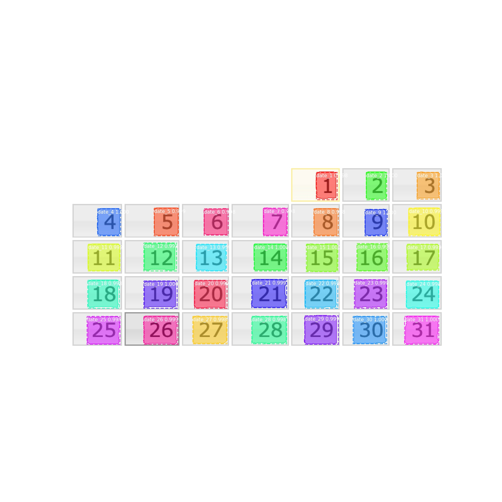

## calendar_mask_rcnn 日历上印刷体数字识别、定位

- [Background](#background)
- [Install](#install)
- [Usage](#usage)
- [Example](#example)
- [Notes](#notes)

### Background
有人找我想做一个日历上数字的识别 + 坐标定位功能，用来实现自动化。          
数字识别最经典的案例是 **MNIST** 数据集，然后使用最简单的 TensorFLow 模型就可以达到很好的识别率。       
日历上包括 1～31 这些数字，总的来看还是 0～9 这些数字。但是坐标定位这个问题无法解决，所以还是自己训练了一下。    
样本只有一张图片，其实这根本没有预测，因为训练和识别是同一张图片。没有体现AI预测功能的精髓啊。

### Install
安装第三方依赖包
```bash
pip3 install -r requirements.txt
```

### Usage
- 训练你自己的模型，使用预训练模型 mask_rcnn_coco.h5 
  - 当然要先使用 标注工具 手动打标签        
  - 这个 mask_rcnn_coco.h5 预训练模型官方地址有下载的，文件太大了，我删掉了
  ```bash
  !CUD_VISIBLE_DEVICES=0 python3 train.py train --dataset=/path/calendar_mask_rcnn/dataset/train/ --weights=/path/calendar_mask_rcnn/model/mask_rcnn_coco.h5
  ```
- 预测单张图片
```bash
!CUDA_VISIBLE_DEVICES=0 python3 train.py inference --weights=/path/calendar_mask_rcnn/model/mask_rcnn_calendar_0014.h5 --image=/path/calendar_mask_rcnn/dataset/train/sample.jpg 
```
- 预测一个文件夹中的所有图片
```bash
!CUDA_VISIBLE_DEVICES=0 python3 train.py inference --weights=/path/calendar_mask_rcnn/model/mask_rcnn_calendar_0014.h5 --path=/path/calendar_mask_rcnn/dataset/train/
"""
```

### Example


### Notes
- 首次启动代码，要加载 h5 文件，所以会很慢。
- 99%代码拷贝自官方 Keras 版本 MaskRcnn 仓库，自己稍作了修改。
